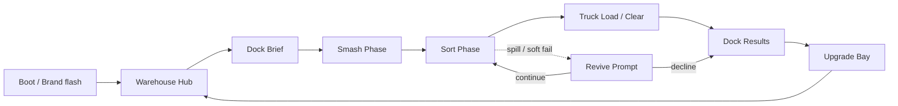

# Crate Crush: Dock Rush — UI/UX + Asset Direction v1
**Studio:** Ratio Studios · **Owner (art/UI):** Vale · **Concept:** Remy · **To:** Chief  
**Date:** 2026-09-06 · **Scope:** Side-lane (does not pause Harrington FBA art)  
**Constraint:** Clean modular, Unity/Godot-friendly. **No invented game balance numbers** (timers, HP, upgrade costs, rarity weights, ad multipliers — Remy’s systems sheet owns those).

---

## 1) Screen flow (player-facing)

Core path Remy locked: **dock → smash → sort → truck → upgrade**. UI frames that path only.



### Screen-by-screen (modular scenes / states)

| ID | Screen | Purpose | Player input | Exit |
|---|---|---|---|---|
| `SCR_Boot` | Boot | Ratio / Crate Crush mark, 1 beat | None / tap skip | → Hub |
| `SCR_Hub` | Warehouse Hub | Pick next dock, contracts entry, cosmetics entry | Tap dock card / tabs | → Dock Brief |
| `SCR_DockBrief` | Dock Brief | Show lane layout silhouette + cargo type icons (no numbers) | Tap START | → Smash |
| `SCR_Smash` | Smash Phase | Full-screen dock; crates stacked; smash affordance | Tap / hold smash on crates | → Sort when smash burst resolves |
| `SCR_Sort` | Sort Phase | Cascading cargo + lane targets | Swipe / drag cargo to lanes | → Truck when lanes accept; or → Revive on spill fail |
| `SCR_Revive` | Revive Prompt | Soft-fail near-miss; optional continue | Accept / decline (ad/consumable owned by systems) | → Sort or Results |
| `SCR_Truck` | Truck Load | Cargo streams into truck bay; clear sting | Tap continue (or auto) | → Results |
| `SCR_Results` | Dock Results | Haul summary, streak, contract ticks (values from systems) | Tap CONTINUE | → Upgrade |
| `SCR_Upgrade` | Upgrade Bay | Smash / lanes / forklift / cosmetics tabs | Select node → Confirm | → Hub |
| `SCR_Collection` | Cargo Book *(hub tab)* | Rarity collection — cosmetics/identity, not power | Back | → Hub |
| `SCR_Settings` | Settings | Mute default ON for UA capture; haptics | Back | → Hub |

**Flow rules**
- One primary CTA per screen (thumb-zone bottom-center / bottom-right).
- Smash → Sort is a **phase swap on the same dock stage** (same camera, UI chrome swaps) — not a hard load — so mute TikTok can film continuous action.
- Upgrade never blocks return to Hub; unfinished contract badge lives on Hub dock card.
- No paywall screens in this pack; IAP/ad sheets are Remy + Ari.

### Recommended scene graph (engine)

```
App
├── Boot
├── Hub (additive UI)
│   ├── DockSelect
│   ├── ContractsPanel
│   └── CollectionPanel
└── DockRun (single stage root — reusable Prefab)
    ├── Stage_Dock (lanes, truck bay, forklift silhouette)
    ├── Phase_Smash
    ├── Phase_Sort
    ├── Phase_Truck
    ├── Overlay_Revive
    ├── Overlay_Results
    └── Overlay_Upgrade  *(or separate Hub_Upgrade scene if memory prefers)*
```

Prefab rule: **Stage_Dock** + cargo prefabs are data-driven (ScriptableObject / Resource); phases are state machine on `DockRunController`.

---

## 2) Color + legibility rules (mute TikTok readable ≤1.5s)

Goal: stills and mute video read **smash → color-sort → truck** without VO. Aligns with Remy’s 5s UA skeleton.

### Palette roles (not final hex lock — direction)

| Role | Direction | Use |
|---|---|---|
| `BG_Dock` | Cool concrete / warehouse grey-blue | Stage floor, walls — low chroma so cargo pops |
| `BG_UI` | Slightly darker panel slate | HUD plates, upgrade cards |
| `Accent_Smash` | Warm impact (amber/orange flash, short) | Smash FX only — **not** UI chrome |
| `Cargo_*` | High-chroma, **mutually distinct** hues | Sort readability (see cargo set below) |
| `Lane_Match` | Same hue family as cargo, desaturated rim | Lane mouths / floor stripes |
| `Safe` / `Warn` / `Fail` | Green / amber / red — **icons + motion first**, color second | Timer/state (no reliance on color alone) |
| `Text_Primary` | Near-white on dark UI; near-ink on light cards | Titles, CTA |
| `Text_Secondary` | 70% grey | Hints |

**Mute-read rules (hard)**
1. **Silhouette first:** crates, cargo blobs, lanes, truck must read in 1-bit thumbnail test (desaturate + shrink to 120px wide).
2. **One action per beat:** smash = radial burst; sort = directional swipe trails; truck = linear suck into bay.
3. **Cargo colors:** max **5–6** simultaneous types on screen in early docks; each type unique hue **and** unique icon glyph (shape coding for CVD / mute).
4. **No neon UI chrome** — neon reserved for rare FX skins only; default UI is industrial matte.
5. **Safe margins for organic:** keep critical action inside center 70% vertical (TikTok UI top/bottom). HUD timer top-safe; CTA bottom-safe.
6. **Timer** = ring + icon + motion pulse before color-only panic.
7. **Near-miss spill** = exaggerated squash + contrasting spill puddle hue vs floor so catch reads mid-frame.
8. **Text on UA hooks:** ≤6 words; high contrast; no paragraph. In-game tutorial text optional after first dock.
9. **Default audio off in editor capture preset** — haptics + big FX carry mute feel.
10. **Colorblind check:** deuteranopia simulate before locking cargo palette; never red-vs-green only pair for two critical types.

### HUD chrome (Smash/Sort shared)

- Top: dock name (short) · timer ring · soft-currency chip (optional, small).
- Mid: clean stage — no banners.
- Bottom: phase hint icon only (fist → swipe arrows) — disappears after first successful action of session.
- No junk currency popups during smash/sort; batch to Results.

---

## 3) First asset pack list (v1 — modular)

Naming: `CC_DockRush_<Category>_<Name>_v1` · Prefer **PNG atlas + optional Spine/Aseprite later**; meshes stay simple (quads / low-poly) for mobile.

### A. Crates (`CC_Crate_*`)
| Asset | Notes | Modular |
|---|---|---|
| `Crate_Wood_Closed` | Default smash target | Swap skin material |
| `Crate_Wood_Cracked` | Pre-break interstitial | |
| `Crate_Wood_Debris` | 4–6 chip sprites | Pooled FX |
| `Crate_Metal_Closed` | Heavier silhouette (unlock later visually) | Same smash API |
| `Crate_Skin_*` | Cosmetic shells (pass) | Data-only overrides |

### B. Cargo types (`CC_Cargo_*`) — shape + color coded
| Asset | Glyph direction | Color role |
|---|---|---|
| `Cargo_BoltBox` | Hex / box | Type A |
| `Cargo_Barrel` | Cylinder | Type B |
| `Cargo_Pallet` | Flat square | Type C |
| `Cargo_Canister` | Tall capsule | Type D |
| `Cargo_Parcel` | Soft bag | Type E |
| `Cargo_Hazard` *(optional late)* | Triangle mark | Warn — still shape-coded |

Each cargo: **idle**, **airborne**, **lane-seat**, **spill** variants (same mesh/sprite, state).

### C. Lanes (`CC_Lane_*`)
| Asset | Notes |
|---|---|
| `Lane_Base` | Floor strip + mouth collider visual |
| `Lane_Rim_TypeA–E` | Recolorable rim / icon plaque |
| `Lane_FillMeter` | Simple vertical/horizontal fill (no numbers required on meter — fill ratio from systems) |
| `Lane_Decal_Skin_*` | Cosmetics |

### D. Forklift (`CC_Forklift_*`)
| Asset | Notes |
|---|---|
| `Forklift_Hero_Default` | Silhouette readable side ¾; timer antagonist presence |
| `Forklift_Idle / Approach / Warn` | Pose or frame set |
| `Forklift_Skin_*` | Premium pass cosmetics — no power |

### E. Stage / truck (`CC_Stage_*`)
| Asset | Notes |
|---|---|
| `Dock_Floor`, `Dock_Wall`, `Dock_SkyStrip` | Parallax-light |
| `Truck_Bay_Empty / Filling / Full` | Clear sting readable mute |
| `Truck_Cab_Simple` | Optional |
| `Env_Cone`, `Env_Light`, `Env_Signage` | Set dressing, low noise |

### F. FX (`CC_FX_*`)
| Asset | Mute job |
|---|---|
| `FX_Smash_Burst` | 0.8–1.5s UA beat |
| `FX_Smash_HitStopFlash` | 1–2 frames white/amber |
| `FX_Cargo_Bounce` | Sort juice |
| `FX_Lane_Accept` | Positive confirm |
| `FX_Spill_Puddle` | Near-miss readable |
| `FX_Truck_Suck` | Linear clear |
| `FX_PerfectClear_Sting` | End beat |
| `FX_Upgrade_Spark` | Meta juice (Hub/Upgrade only) |

### G. UI kit (`CC_UI_*`)
| Asset | Notes |
|---|---|
| `Panel_Plate`, `Btn_Primary`, `Btn_Ghost` | 9-slice |
| `Icon_Smash`, `Icon_Swipe`, `Icon_Truck`, `Icon_Upgrade` | Phase literacy |
| `Icon_CargoType_A–E` | HUD + brief |
| `Timer_Ring` | |
| `Badge_Contract`, `Badge_Streak` | Hub / Results |
| `Font_Display` / `Font_Body` | Engine font assets — bold display for UA text overlays |

### H. Out of pack (explicit non-goals for v1)
- Full character mascot
- Complex 3D warehouse walkaround
- Harrington / Grandison brand marks inside game
- Balance curves, drop tables, ad multipliers (Remy)

---

## 4) Hand-off

| Partner | Needs from this pack |
|---|---|
| Remy | Flow IDs + phase boundaries to bind systems sheet |
| Ari / Brooks | Mute rules §2 + FX smash/sort/truck beats for templates |
| Kade | Screen IDs for event schema hooks |
| Eng | Prefab graph + asset list naming |

**Done when:** Chief has this packet; Remy can attach economy without art inventing numbers; Brooks can film smash→sort→truck against §2 rules.

**Paths:** `/workspace/ratio-studios/crate-crush/UI-UX-ASSET-DIRECTION-v1.md`
